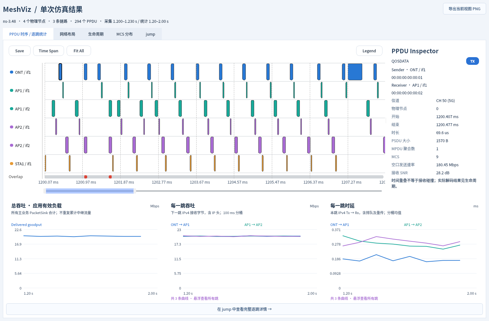
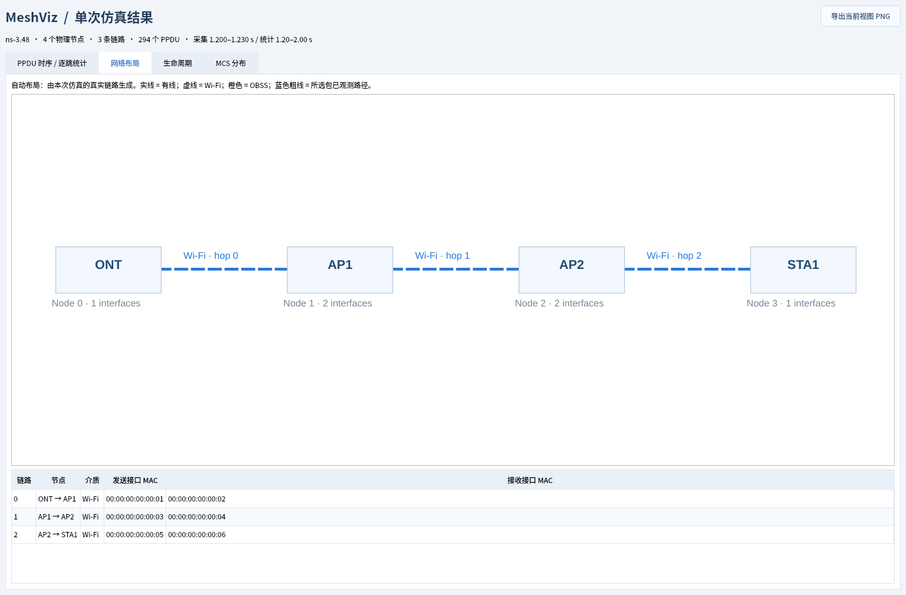
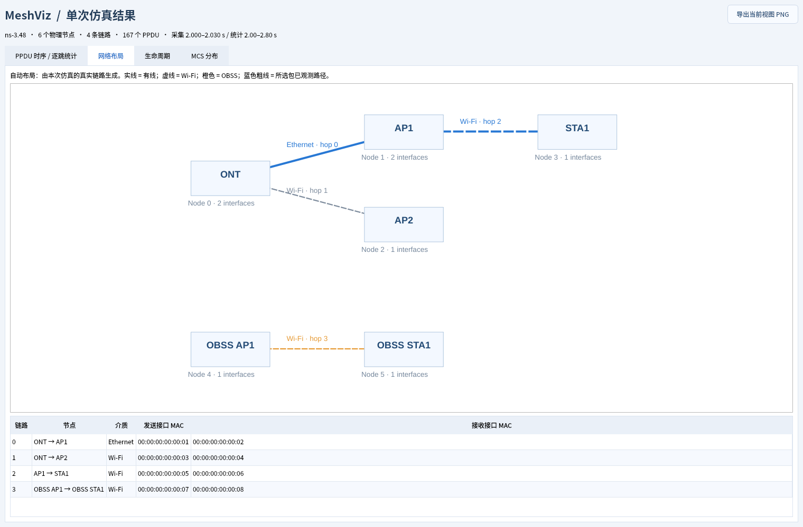
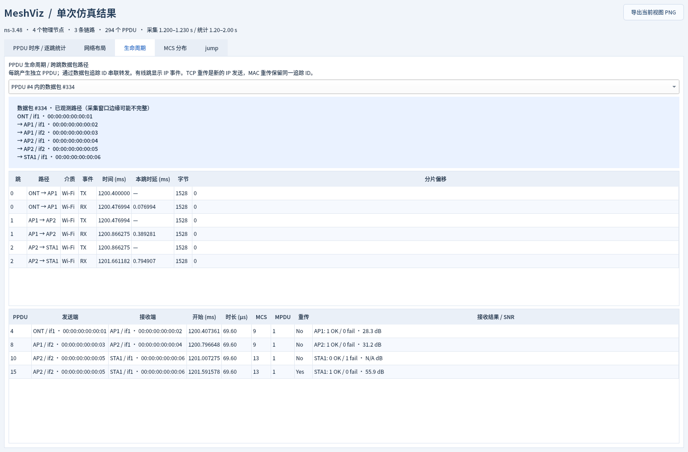
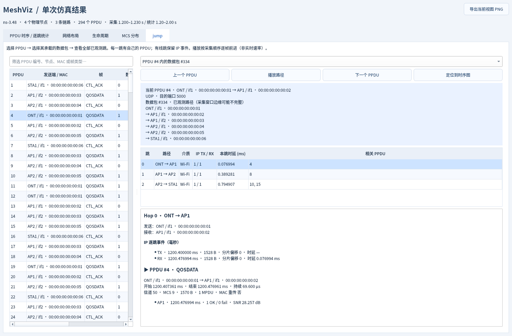

# MeshViz — ns-3.48 单次 Mesh 仿真可视化

轻量 `contrib/meshviz` 模块。复用 [WiFiViz](https://github.com/z14212638-eng/WiFiViz) 的 Qt PPDU 时序渲染器，**运行一次脚本 → 保存一份结果 → 查看这次结果**。没有场景配置页面、脚本生成器、后台服务、共享内存、Boost 或第三方 JSON 库。



## 功能

- **原生 PPDU 时序图**：滚轮缩放、拖拽平移、时间范围选择、全局范围滑块、Fit All、点选详情、图片导出。默认放大到前 8 ms，避免大量帧挤成细线。
- **jump 逐跳检查页**：按 PPDU 编号、节点、MAC 或帧类型搜索。选择聚合中的具体数据包，列出完整已观测路径，每跳展示 TX/RX、时延、相关 PPDU；点击跳可查看所有无线发送、重传、接收/丢弃原因与 SNR。支持上一个/下一个、播放/暂停，以及定位回时序图。播放按 PPDU 顺序每 700 ms 前进，不代表仿真实时速率；到末尾回到起点并停止。
- **自动树状网络布局**：双天线路由器图标；滚轮缩放、拖动平移、双击复位。绿线标识当前检查的跳，蓝线标识所选包的其余路径。从本次实际设备连接生成，从左到右按拓扑层级排布，不使用物理坐标定位。星形、链形、STA 接入点、混合有线回程、OBSS 自动反映在图中。
- **稳定身份**：显式登记物理节点 `ONT / AP1 / AP2 / STA1`，每个接口 MAC 映射回所属节点。时序行显示 `AP1 / if1`、`AP1 / if2`，同节点同颜色，不把 AP 的上游 STA 接口另起一个 STA 编号。
- **PPDU 生命周期 / 数据包跨跳路径**：选中 PPDU 后选择它承载的具体数据包，查看 `MAC（节点/接口）→ …`、逐跳 TX/RX、无线 PPDU、重传、聚合、MCS、接收结果和 SNR；图中高亮已经观测到的路径。
- **TCP / UDP**：两种业务都支持，使用原 ZIP 中的 8 种拓扑和 3 种 STA 接入方式；支持 A-MPDU/A-MSDU 和 IP 分片。
- **MCS 分布**：复用 WiFiViz 原生直方图，按物理节点筛选，含 Legacy 桶。
- **逐跳时延、总吞吐、逐跳吞吐**：悬浮显示对应时间桶的精确数值和所有跳，时延另列样本数及最大值；滚轮围绕鼠标缩放、双击复位。统计窗口与详细 PPDU 捕获窗口分离。捕获上限不截断完整统计。






## 安装 / 编译

需要 ns-3.48、C++ 编译器、CMake、Python 3。查看器使用 Qt 6 Widgets（也支持 Qt 5.15）；不需要 Qt Charts。Linux 示例：

```bash
# Ubuntu / Debian
sudo apt install g++ cmake python3 qt6-base-dev fonts-noto-cjk

cd /path/to/ns-3.48
git clone https://github.com/z14212638-eng/mesh-viz.git contrib/meshviz
python3 contrib/meshviz/tools/install.py
./ns3 configure -d optimized --enable-modules=meshviz,csma --disable-examples --disable-tests
./ns3 build mesh_test_obss_metrics -j 4
cmake --build cmake-cache --target meshviz-viewer -j 2
```

`install.py` 把随模块携带的脚本安装到 ns-3 的 `scratch/`。不同内容的已有文件不会被覆盖，需自行备份或合并。模块依赖由 ns-3 自动解析；录制器无需 Qt，缺少 Qt 时仍可以构建仿真并生成记录。

## 一次运行，一份结果

直接用 ns-3 原生命令，`--enableMeshviz=1` 在仿真结束后自动打开这次结果：

```bash
cd /path/to/ns-3.48
# 全无线星型，STA 接 AP1，TCP
./ns3 run "mesh_test_obss_metrics --mode=1 --staAssoc=ap1 --trafficType=tcp --tcpStreams=1 --appRate=20Mbps --prewarm=1.2 --test=0.8 --enableMeshviz=1"

# 全无线链型，STA 接 AP2，UDP
./ns3 run "mesh_test_obss_metrics --mode=5 --staAssoc=ap2 --trafficType=udp --tcpStreams=1 --appRate=20Mbps --prewarm=1.2 --test=0.8 --enableMeshviz=1"

# 无桌面环境：只保存结果
./ns3 run "mesh_test_obss_metrics --mode=1 --staAssoc=ap1 --enableMeshviz=1 --openMeshviz=0"
```

`mode=1/2/3/4` 为星型，两条回程分别是 无线/无线、有线/无线、无线/有线、有线/有线；`mode=5/6/7/8` 是对应的链型。正常桌面下关闭查看器后命令退出。

开关默认关闭。启用后，结果自动保存到当前运行目录下 `meshviz-results/run-<时间戳>-<序号>/`，包含 `run.jsonl` 和 `metrics.csv`，重复运行不会覆盖之前的自动结果。可以通过 `--meshviz=路径/run.jsonl` 指定采集位置，通过 `--out=路径/metrics.csv` 指定 CSV。Qt 可用时，`./ns3 run` 的构建步骤会同时构建查看器；缺少 Qt 时仍能用 `--openMeshviz=0` 录制。

之前的 `python3 contrib/meshviz/tools/run.py -- ...` 启动器仍可使用，但不是必需入口。

也可以只跑 C++ 脚本，再随时打开结果：

```bash
./ns3 run 'mesh_test_obss_metrics --mode=5 --staAssoc=ap2 --trafficType=udp --prewarm=1.2 --test=0.8 --tcpStreams=1 --appRate=20Mbps --meshviz=run.jsonl --out=metrics.csv'
./build/contrib/meshviz/meshviz-viewer run.jsonl
# 仓库内提供真实仿真结果，不必先运行仿真
./build/contrib/meshviz/meshviz-viewer contrib/meshviz/doc/example.jsonl
```

| 参数 | 含义 |
|---|---|
| `--enableMeshviz=1` | 开启本次采集并自动打开查看器，默认关闭 |
| `--openMeshviz=0` | 启用采集但不打开窗口，适合无桌面运行 |
| `--meshviz=FILE` | 指定记录文件；不启用 enableMeshviz 时为仅采集模式。两者均省略则不记录，适合批量扫描 |
| `--captureStart=SECONDS` | 详细捕获开始时刻，默认等于 `prewarm` |
| `--captureDuration=SECONDS` | 默认 0.15 秒 |
| `--maxPpdus=N` | 默认最多 100000 个 PPDU；触发后界面显示提示 |
| `--prewarm` / `--test` | 指标窗口为 `[prewarm, prewarm+test)` |

强 OBSS 干扰可能导致关联或业务建立较慢，短窗口里出现零吞吐是仿真结果；可增加预热时间或先降低干扰流量核查。捕获窗口以外的路径不会被补造。

## 单独构建离线查看器

无 ns-3、无服务器也能打开已经生成的记录：

```bash
cmake -S ui -B build
cmake --build build -j 2
./build/bin/contrib/meshviz/meshviz-viewer doc/example.jsonl
```

导出五页 PNG（可在无桌面环境运行）：

```bash
QT_QPA_PLATFORM=offscreen QT_QPA_PLATFORMTHEME=generic \
  ./build/contrib/meshviz/meshviz-viewer contrib/meshviz/doc/example.jsonl \
  --export /path/to/exported-figures
```

## 接入其他脚本

```cpp
#include "ns3/meshviz-helper.h"

// 在节点、设备、IP 和应用完成安装后、Simulator::Run() 之前：
MeshvizHelper viz("run.jsonl", Seconds(1), Seconds(5), Seconds(1), Seconds(1.15));
viz.SetFlow(staIp, 5000, 1); // 主业务目的 IP、起始目的端口、流数量
viz.AddNode(ont, "ONT");
viz.AddNode(ap1, "AP1");
viz.AddNode(sta, "STA1");
viz.AddLink(backhaulDevices, true); // 两个实际 NetDevice，按正向路径登记
viz.AddLink(accessDevices, true);
viz.TrackSink(packetSink);          // 可登记多个主业务 PacketSink
Simulator::Run();
viz.Finish();
Simulator::Destroy();               // viz 必须活到 Destroy() 之后
```

完整示例见 [`scratch/mesh_test_obss_metrics.cc`](scratch/mesh_test_obss_metrics.cc)。背景 OBSS 链路用 `AddLink(devices, true, true)` 登记，只在拓扑和空口时间线中展示，不混入主业务吞吐。

## 指标与追踪口径

- **PPDU 是单跳的无线传输**，转发会创建新的 PPDU。跨跳关联对象是有唯一 ByteTag 的 IP 数据报；一个 PPDU 可以包含多个追踪 ID，一个 ID 可以出现在多跳和多次 MAC 重传中。
- 在 IPv4 `SendOutgoing` 给实际数据包添加 ByteTag；不能在 IPv4 `Tx` 的临时拷贝上添加。标记经转发、A-MSDU/A-MPDU 和分片保留。分片分别按 `(ID, hop, fragmentOffset)` 配对；TCP 的再次 IP 发送与 MAC 重传区分记录，记录中包含 TCP sequence。
- **身份校验**：有 TA 字段的帧强制检查 `Addr2 == 实际发射设备 MAC`；ACK/CTS 没有 TA，使用 PHY 回调绑定的发射设备。所有 MAC 都来自实际设备，不以接入角色猜测物理身份。
- **每跳时延**：本跳 IPv4 Tx 到下一跳 IPv4 Rx，包括本跳排队、接入、重传和传输；不是端到端时延，不是主动 probe RTT。曲线显示 100 ms 桶内均值；记录另存最大值与样本数。丢失包无时延值，未配对的待接收状态超过 10 秒后在下一次定期清理时释放；更长排队的包保留吞吐统计，但不产生缺失配对的时延样本。
- **每跳吞吐**：主业务正向 IPv4 接收字节，包含 IP/传输层头；每次成功接收统计一次，不按 PPDU 空口重传次数累加。**总吞吐**：各主业务 PacketSink 交付的应用字节合计，不把多跳吞吐相加。最后不足 100 ms 的桶按实际长度计算。
- **Inspector 空口发送速率**：PSDU 字节 × 8 / PPDU 时长，包含开销且不保证接收成功；与图中的交付吞吐不同。
- `RxOutcome` 给出目的接收端的逐 MPDU 成功/失败，`PhyRxPpduDrop` 记录真实丢弃原因；未产生结果的接收标为“未观测”。ns-3.48 在全 MPDU 失败时未初始化该回调的 SNR，此时输出 `null`。时间重叠仅显示为 Overlap，不能据此推断碰撞。
- 当前记录器针对这些场景中的 **单链路、SU Wi-Fi + 点对点 CSMA 回程、IPv4 单播主业务**。不宣称支持 MU-OFDMA/MLO、动态路由重构、任意二层桥接追踪或 IPv6。

## ZIP 脚本迁移

保留网格扫描、批量任务、SVG 热力图和 Excel 汇总脚本；统一到 ns-3.48 可执行文件，移除原机器的绝对路径，补齐 ZIP 缺少旧 C++ 脚本时的入口，修复 UDP 逐跳统计、GuardInterval 设置时机，增加单次记录开关。旧 CSV 中的 RTT/P95 字段为兼容批量分析继续保留，新的可视化不使用它们冒充逐跳单向时延。Excel 功能仍需要原脚本使用的 `openpyxl`，与查看器和录制器无关。

## 验证

```bash
# 原生命令入口、自动输出目录和查看器启动验证
python3 contrib/meshviz/test/cli-entry.py

# 完整场景验证（无需启用 ns-3 的全套测试）
python3 contrib/meshviz/test/integration.py --report /path/to/validation.json

# 原生模块测试：已知 10 ms 链路、IP 开销与应用有效负载口径
./ns3 configure -d optimized --enable-modules=meshviz,csma \
  --enable-examples --enable-tests --filter-module-examples-and-tests=meshviz
./ns3 build test-runner -j 4
./test.py --no-build -s meshviz
```

测试运行真实 ns-3 仿真，覆盖 8 × 3 × 2 个组合、TCP/UDP OBSS、高负载聚合、无聚合和不完整时间桶、MAC 唯一归属、完整跨跳关联、逐跳吞吐与 CSV 对照、应用吞吐对照、采集上限和开关记录不改变仿真结果。临时数据位于 `~/Work`（可用 `--work-dir` 修改），完成后自动清理。52 个场景全部通过；已执行的结果见 [`doc/validation.json`](doc/validation.json)，原生测试结果见 [`doc/native-test.txt`](doc/native-test.txt)。界面在 Qt 6 上实际导出并检查过五页 PNG；新增 Qt Test 鼠标/键盘/定时器验证，覆盖逐跳选择、帧搜索、播放、ACK 无跨跳路径、聚合成员切换、悬浮数值、图表/拓扑缩放与复位，并模拟深色系统调色板核对文字可读性。

交互测试可独立构建（不会增加正常查看器的运行依赖）：

```bash
cmake -S ui -B ~/Work/meshviz-ui-check -DMESHVIZ_UI_TESTS=ON
cmake --build ~/Work/meshviz-ui-check -j 2
QT_QPA_PLATFORM=offscreen QT_QPA_PLATFORMTHEME=generic \
  MESHVIZ_TEST_TRACE="$PWD/doc/example.jsonl" \
  ~/Work/meshviz-ui-check/bin/meshviz-ui-test
# 对高负载 TCP 采集文件再运行 aggregateSelection，验证大聚合成员选择。
```

查看器固定使用浅色调色板，表格、下拉框、详情和提示文字不会继承桌面的白色前景。PNG 是导出的静态图片；上述交互在 `meshviz-viewer` 程序中使用。

## 来源 / 许可

MIT。PPDU 时间线、详情界面及辅助控件派生自 WiFiViz；精确来源提交见 [`doc/UPSTREAM.txt`](doc/UPSTREAM.txt)，保留[原许可证](doc/WiFiViz-LICENSE)。ns-3.48 本体未复制进该模块仓库，也未修改 `src/`。
